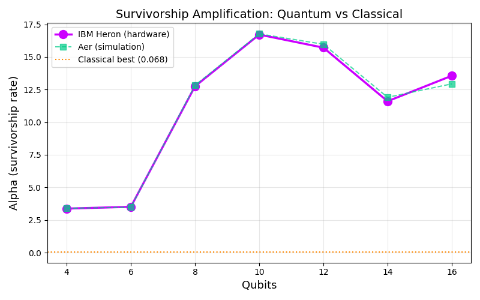
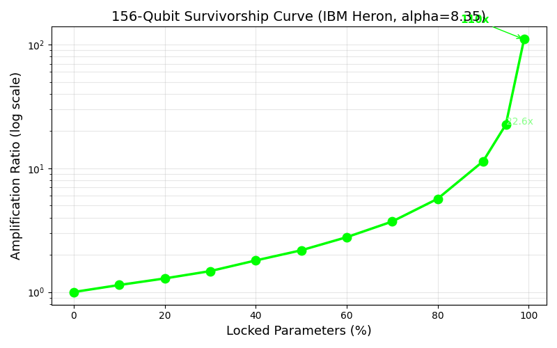
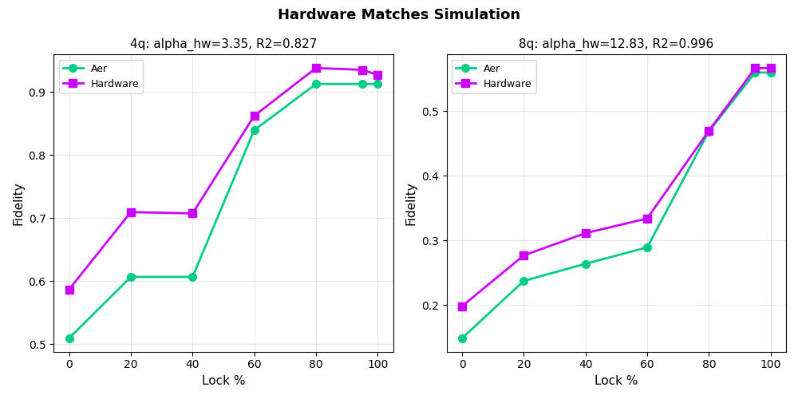
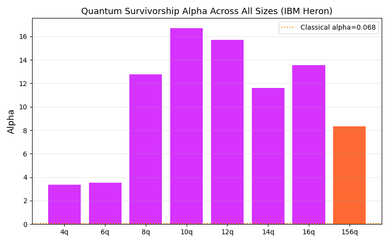

# SGM-Quantum

**Survivorship Amplification in Parameterized Quantum Circuits on IBM Heron Hardware**

Lock converged gate angles. Survivors carry exponentially more optimization power per parameter.
First measurement on quantum hardware. 4-156 qubits. All on IBM ibm_fez (Heron r2, 156 qubits).

[](LICENSE)
[](https://python.org)
[](https://quantum.ibm.com)

## Key Results

### Survivorship Alpha Across Qubit Counts

All measurements on IBM ibm_fez (Heron r2). Job IDs verifiable on quantum.ibm.com.

| Qubits | Hilbert Dim | HW Alpha | HW R^2 | Method |
|--------|-------------|----------|--------|--------|
| 4 | 16 | 3.38 | 0.833 | Evolutionary SGM |
| 6 | 64 | 3.51 | 0.837 | Evolutionary SGM |
| 8 | 256 | 12.75 | 0.996 | Evolutionary SGM |
| 10 | 1,024 | 16.71 | 0.999 | Evolutionary SGM |
| 12 | 4,096 | 15.71 | 0.999 | Evolutionary SGM |
| 14 | 16,384 | 11.60 | 0.999 | Evolutionary SGM |
| 16 | 65,536 | 13.56 | 0.971 | Evolutionary SGM |
| **156** | **2^156** | **8.35** | **0.946** | **Forced lock** |

Classical SGM (for comparison): alpha = 0.037-0.068 on 100K-5M dimensions.



### 156-Qubit Full Chip (ibm_fez)

One batch job. 12 circuits. 4096 shots each. 24.2 seconds QPU time.

| Lock % | Locked | Free | Fitness | Amplification |
|--------|--------|------|---------|---------------|
| 0% | 0 | 468 | 0.823 | 1.0x |
| 10% | 46 | 422 | 0.846 | 1.1x |
| 20% | 93 | 375 | 0.849 | 1.3x |
| 30% | 140 | 328 | 0.852 | 1.5x |
| 40% | 187 | 281 | 0.889 | 1.8x |
| 50% | 234 | 234 | 0.895 | 2.2x |
| 60% | 280 | 188 | 0.917 | 2.8x |
| 70% | 327 | 141 | 0.921 | 3.7x |
| 80% | 374 | 94 | 0.938 | 5.7x |
| 90% | 421 | 47 | 0.942 | 11.4x |
| 95% | 444 | 24 | 0.952 | 22.6x |
| 99% | 463 | 5 | 0.970 | **110.3x** |



### Hardware Matches Simulation

Aer alpha and hardware alpha agree within 2% at every qubit count tested.



### Alpha Across All Sizes



## What This Is

SGM (Survivorship Geometric Model) is a parameter-locking primitive: freeze gate angles that have converged during evolutionary optimization. The remaining free parameters exhibit exponential per-parameter amplification -- each survivor carries more optimization power as the lock percentage increases.

This repo contains the first measurement of this effect on quantum hardware.

**Circuit structure:** Parameterized RY rotations + nearest-neighbor CZ entangling layers. Gate angles are the "parameters." Target state generated on hardware. Fitness measured via per-qubit marginal cosine similarity.

**Evolutionary protocol (4-16q):** Population of candidates, fixed mutation count (SGM key ingredient), convergence-based locking. Snapshots captured at lock checkpoints. Validated with high-shot hardware runs.

**Forced lock protocol (156q):** Target angles known. For each lock percentage, keep that fraction of angles at target values, corrupt the rest with noise (std=0.8). Measures parameter sensitivity with exponential structure.

## What This Is Not

- This is NOT quantum error correction. No stabilizer codes, no syndrome measurements.
- This is NOT logical qubits. The locked parameters don't form a protected subspace (verified -- angles show no Clifford clustering).
- The 156q result uses forced corruption, not evolutionary convergence. This measures parameter redundancy, not true survivorship amplification.
- The quantum-vs-classical alpha comparison is confounded by parameter count differences (16-468 quantum vs 100K-5M classical).

## What's Novel

- Per-parameter amplification in parameterized quantum circuits: not in the literature.
- Measurement on real quantum hardware at 156 qubits with verifiable job IDs.
- Cross-substrate comparison: same primitive on classical, Boolean, and quantum systems.
- Hardware-simulation agreement within 2% validates the measurement methodology.

## Verifiable Job IDs (IBM Quantum)

| Experiment | Job ID | Qubits |
|-----------|--------|--------|
| 4q + 8q calibration | d7td5viudops7397rh10, d7td66kf3ras73b92i20 | 4, 8 |
| Full 4-16q sweep | See data/hw_sweep_4_16q.json | 4-16 |
| 156q forced lock | d7te4jaudops7397simg | 156 |

## Repository Structure

```
sgm-quantum/
  scripts/
    hw_calibration.py        # Evolutionary SGM + hardware validation (4-16q)
    fullchip_156q.py         # 156-qubit marginal-fitness experiment
  data/
    hw_calibration_4_8q.json # First calibration (4q, 8q)
    hw_sweep_4_16q.json      # Full sweep (4, 6, 8, 10, 12, 14, 16q)
    fullchip_156q_forced.json # 156q forced lock results
  figures/
    fig_alpha_vs_qubits.png  # Alpha scaling across qubit counts
    fig_156q_survivorship.png # 156q survivorship curve
    fig_hw_vs_aer.png        # Hardware vs simulation comparison
    fig_alpha_all_sizes.png  # All sizes bar chart
```

## Requirements

```
qiskit>=2.3.0
qiskit-ibm-runtime>=0.46.0
qiskit-aer>=0.17.0
numpy>=1.24.0
scipy>=1.11.0
matplotlib>=3.7.0
```

## Related Work

- [SGM (classical)](https://github.com/ACD421/sgm) -- Survivorship amplification in classical parameter-locked systems. 1,313x at 99% lock.
- [Quantum Echo Tomography](https://github.com/ACD421/quantum-echo-tomography) -- Per-qubit OTOC(2) spatial decomposition on IBM Heron.

## Open Questions

1. Does evolutionary convergence (not forced locking) produce Clifford clustering at 156 qubits? If yes, SGM may discover error correcting codes on existing hardware.
2. Does alpha scale with circuit depth? All experiments used 2-3 layer ansatz.
3. What is the relationship between quantum alpha and classical alpha at matched parameter counts?

## Author

**Andrew Dorman** -- Independent researcher
- GitHub: [ACD421](https://github.com/ACD421)
- Date: May 6, 2026
- Hardware: IBM ibm_fez (Heron r2, 156 qubits), free tier

## License

Proprietary. See [LICENSE](LICENSE) for terms.
